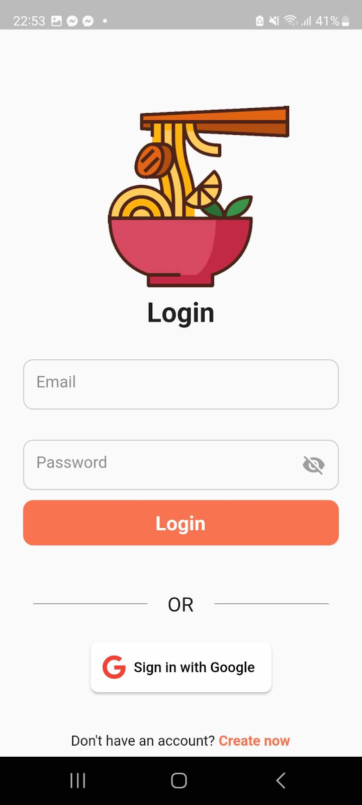
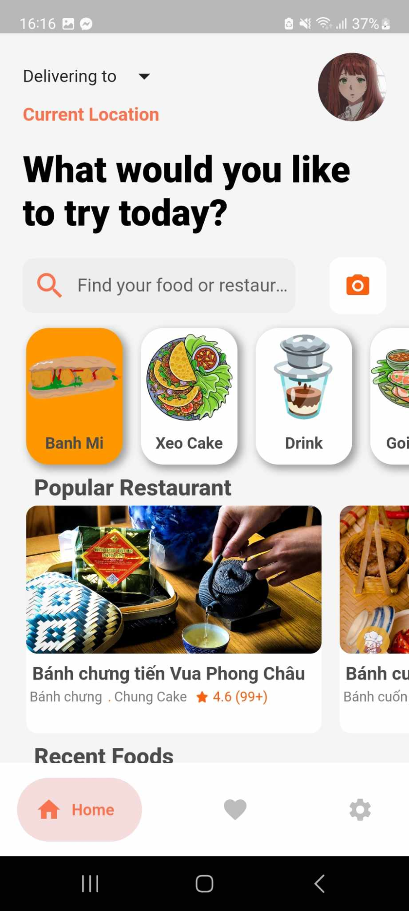
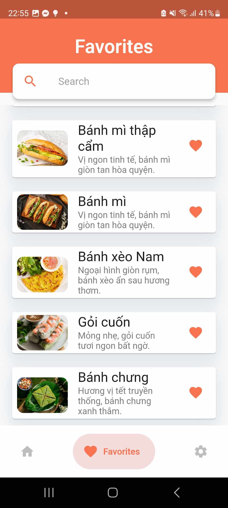
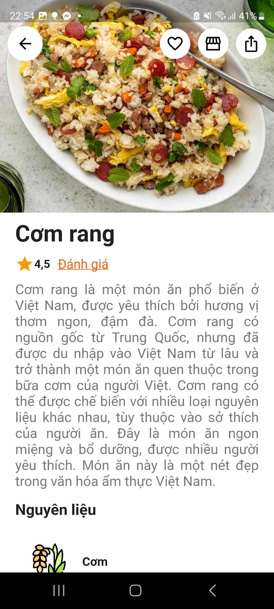
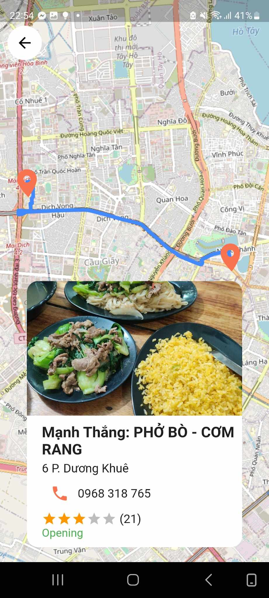
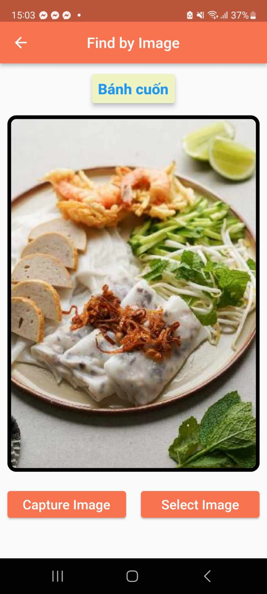

  

<h1 align="center"> WikiFoodia 👋</h1>

> Dự án mobile được làm tại môn INT3115 1 - UET, VNU - Kì I 2023-2024

## Tác giả

👤 **Phạm Minh Hiếu, Ma Thanh Thiện, Nguyễn Trung Hiếu**

* Github: [@PhamH1eu](https://github.com/PhamH1eu)
* Github: [@thanhthien1305](https://github.com/thanhthien1305)
* Github: [@hieucronc](https://github.com/hieucronc)

## Về dự án này
Ứng dụng wikiFoodia giới thiệu cho du khách các đặc sản của quê hương Việt Nam

## Công nghệ
Chúng tôi sử dụng framework Flutter dựa trên Dart và xác thực người dùng bằng Firebase

## Chức năng 
### Chức năng yêu thích món ăn
### Xem thông tin món ăn
### Xem vị trí, gọi, thông tin về cửa hàng
### Nhận diện món ăn bằng camera
### Tìm kiếm món ăn
### Chia sẻ món ăn với người khác
### Lọc món ăn theo loại
### Trang cá nhân người dùng

## Một số hình ảnh của ứng dụng

